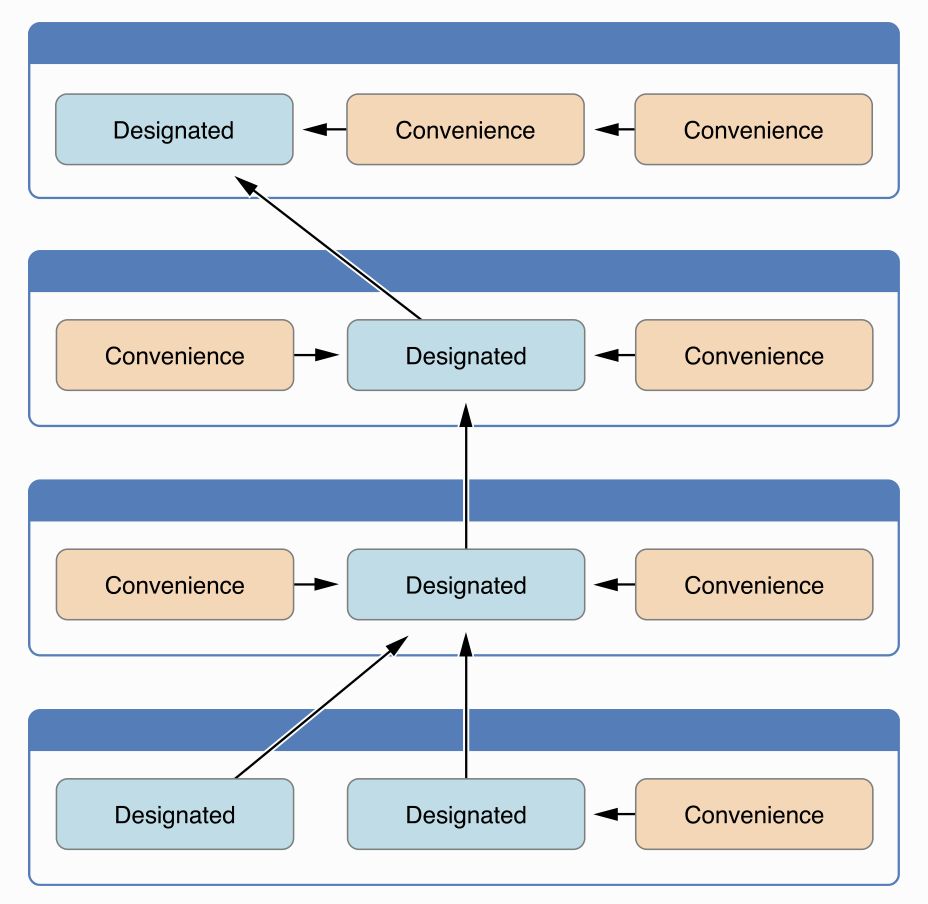

[TOC]

### Initial Values 

Stored Properties

- setting values in Initializer
- specify a default property value as part of the property’s declaration

```swift
struct Fahrenheit1 {
    var temperature: Double
    init() {
        temperature = 32.0
    }
}

struct Fahrenheit2 {
    var temperature = 32.0
} 
```

Optional Property Types

- automatically initialized with a value of nil

```swift
class SurveyQuestion {
    var text: String
    var response: String?
    init(text: String) {
        self.text = text
    }
    func ask() {
        print(text)
    }
}
```

Constant Properties, once a constant property is assigned a value, it can’t be further modified

- specify a default property value as part of the property’s declaration
- setting values in Initializer

```swift
class IniSurveyQuestion {
    let text: String = "12"			// init
    let text2: String
    var response: String?
    init(text: String) {
        self.text2 = text			// init
    }
    func ask() {
        print(text)
    }
}
```


### Customizing Initialization

Parameter

- Parameter Names and Argument Labels
- Initializer Parameters Without Argument Labels


### Default Initializer

- for any structure or class 
- provides default values for all of its properties 
- does not provide at least one initializer itself

```swift
// default initializer, for class , struct
class InitShoppingListItem {
    var name: String?
    var quantity = 1
    var purchased = false
}

let item = InitShoppingListItem()
print("test default initializer: " , item)
```


### Memberwise Initializers for Structure Types

- do not define any of their own custom initializers
- even if it has stored properties that don’t have default values

```swift
struct Size {
    var width = 0.0, height = 0.0
}
let twoByTwo = Size(width: 2.0, height: 2.0)
```


###  Initializer Delegation for Value Types

initializer delegation

- structures and enumerations
- Initializers can call other initializers

```swift
struct Size {
    var width = 0.0, height = 0.0
}
struct Point {
    var x = 0.0, y = 0.0
}

struct Rect {
    var origin = Point()
    var size = Size()
    init() {}
    init(origin: Point, size: Size) {
        self.origin = origin
        self.size = size
    }
    init(center: Point, size: Size) {
        let originX = center.x - (size.width / 2)
        let originY = center.y - (size.height / 2)
        self.init(origin: Point(x: originX, y: originY), size: size)
    }
}
```


### Class Inheritance and Initialization

Designated initializers 

- are the primary initializers for a class. 
-  fully initializes all properties introduced by that class and
-  calls an appropriate superclass initializer to continue the initialization process up the superclass chain

Convenience initializers

- to call a designated initializer from the same class

- call a convenience initizlizer



#### Initializer Delegation

- A designated initializer must call a designated initializer from its immediate superclass 
- A convenience initializer must call another initializer from the same class
- A convenience initializer must ultimately call a designated initializer

#### Two-Phase Initialization

- In the first phase, each stored property is assigned an initial value by the class that introduced it. 
- second phase, each class is given the opportunity to customize its stored properties further before the new instance is considered ready for use


Four safety-checks to make sure that two-phase initialization is completed without error

- A designated initializer must ensure that all of the properties introduced by its class are initialized before it delegates up to a superclass initializer.
- A designated initializer must delegate up to a superclass initializer before assigning a value to an inherited property. If it doesn’t, the new value the designated initializer assigns will be overwritten by the superclass as part of its own initialization.
- A convenience initializer must delegate to another initializer before assigning a value to any property (including properties defined by the same class). If it doesn’t, the new value the convenience initializer assigns will be overwritten by its own class’s designated initializer.
- An initializer cannot call any instance methods, read the values of any instance properties, or refer to self as a value until after the first phase of initialization is complete.

#### Automatic Initializer Inheritance

Assuming that you provide default values for any new properties you introduce in a subclass, the following two rules apply:

- If your subclass doesn’t define any designated initializers, it automatically inherits all of its superclass designated initializers.
- If your subclass provides an implementation of all of its superclass designated initializers—either by inheriting them as per rule 1, or by providing a custom implementation as part of its definition—then it automatically inherits all of the superclass convenience initializers.


### Failable Initializers

To cope with initialization conditions that can fail, define one or more failable initializers as part of a class, structure, or enumeration definition. 

-  placing a question mark after the init keyword (init?)
- return nil within a failable initializer 


```swift
struct Animal {
    let species: String
    init?(species: String) {
        if species.isEmpty { return nil }
        self.species = species
    }
}
```

#### Failable Initializers for Enumerations

Enumerations with raw values automatically receive a failable initializer

```swift
enum InitTemperatureUnit {
    case kelvin, celsius, fahrenheit
    init?(symbol: Character) {
        switch symbol {
        case "K":
            self = .kelvin
        case "C":
            self = .celsius
        case "F":
            self = .fahrenheit
        default:
            return nil
        }
    }
}

// has default init?(rawValue:)
enum InitTemperatureUnit2: Character {
    case kelvin = "K", celsius = "C", fahrenheit = "F"
}
```

#### Delegation

- A failable initializer of a class, structure, or enumeration can delegate across to another failable initializer from the same class, structure, or enumeration. 

- Similarly, a subclass failable initializer can delegate up to a superclass failable initializer.”

```swift
class Product {
    let name: String
    init?(name: String) {
        if name.isEmpty { return nil }
        self.name = name
    }
}

class CartItem: Product {
    let quantity: Int
    init?(name: String, quantity: Int) {
        if quantity < 1 { return nil }
        self.quantity = quantity
        super.init(name: name)
    }
}	 
```

#### Overriding

“can override a superclass failable initializer in a subclass

