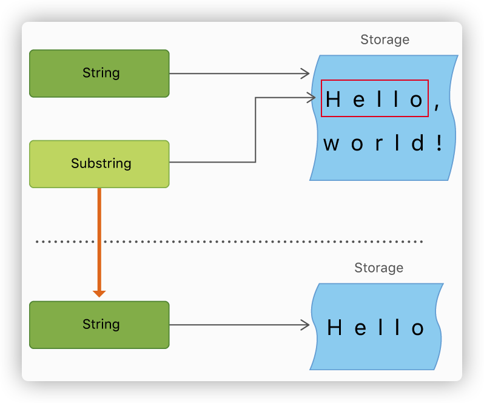

[toc]

### String Literals

```swift
let someString = "Some string literal value 
```

#### Multiline String Literals

```swift
let quotation =
"""
The White Rabbit put on his spectacles.  "Where shall I begin,
please your Majesty?" he asked.

"Begin at the beginning," the King said gravely, "and go on
till you come to the end; then stop."
"""
print(quotation)

// \表示不换行
let softWrappedQuotation =
"""
The White Rabbit put on his spectacles.  "Where shall I begin,
please your Majesty?" he asked.

"Begin at the beginning," the King said gravely, "and go on \
till you come to the end; then stop."
"""
print(softWrappedQuotation)
```

#### Special Characters in String Literals

- The escaped special characters \0 (null character), \\ (backslash), \t (horizontal tab), \n (line feed), \r (carriage return), \" (double quotation mark) and \' (single quotation mark)

- An arbitrary Unicode scalar value, written as \u{n}, where n is a 1–8 digit hexadecimal number (Unicode is discussed in Unicode below)”

```swift
let dollarSign = "\u{24}"        // $,  Unicode scalar U+0024
let blackHeart = "\u{1F496}"      // 💖, Unicode scalar ”

print(dollarSign)
print(blackHeart)
```

#### Extended delimiters

 string literal within extended delimiters can include special characters  without invoking their effect.

if you need the special effects of a character in a string literal, match the number of number signs within the string following the escape character ``\``

```swift
let Delimiters = #"Line 1\nLine 2"#
print(Delimiters)	// Line 1\nLine 2
let Delimiters2 = #"Line 1\#nLine 2\nLine3"#
print(Delimiters2)
// Line 1
// Line 2\nLine3
let Delimiters3 = ###"Line1\###nLine2"###
print(Delimiters3)
// Line1
// Line2
```

#### String Mutability

You can use ``+=`` to extend string.

```swift
var variableString = "Horse"
variableString += " and carriage"
// variableString is now "Horse and carriage”
```

#### String Interpolation

``String interpolation`` is a way to construct a new String value from a mix of constants, variables, literals, and expressions by including their values inside a string literal

```swift
let multiplier = 3
let message = "\(multiplier) times 2.5 is \(Double(multiplier) * 2.5)
```

#### Strings Are Value Types

Swift’s String type is a value type. If you create a new String value, that String value is copied when it’s passed to a function or method, or when it’s assigned to a constant or variable.

Behind the scenes, Swift’s compiler optimizes string usage so that actual copying takes place only when absolutely necessary. This means you always get great performance when working with strings as value types.


### Characters

```swift
let exclamationMark: Character = "!"

let catCharacters: [Character] = ["C", "a", "t", "!", "🐱"]
let catString = String(catCharacters)
print(catString)

for character in "Dog!🐶" {
    print(character)
}
```

#### string append char

you can append a Character value to a String variable

You can’t append a String or Character to an existing Character variable

```swift
let welcome = "hello there"
let exclamationMark: Character = "!"
welcome.append(exclamationMark)
// "hello there!”
```

### Unicode

Swift’s String and Character types are fully Unicode-compliant.

#### Unicode scalar value

- is a unique 21-bit number for a character or modifier,  such as U+0061 for LATIN SMALL LETTER A ("a")
- Swift’s native String type is built from Unicode scalar values

#### Extended Grapheme Clusters

- An extended grapheme cluster is a sequence of one or more Unicode scalars that (when combined) produce a single human-readable character

- Every instance of Swift’s Character type represents a single extended grapheme cluster


```swift
let eAcute: Character = "\u{E9}"                         // é
let combinedEAcute: Character = "\u{65}\u{301}"          // e followed by ́
// eAcute is é, combinedEAcute is é
```

#### Counting Characters

Swift’s use of extended grapheme clusters for Character values means that string concatenation and modification may not always affect a string’s character count.

The count of the characters returned by the count property isn’t always the same as the length property of an NSString that contains the same characters. The length of an NSString is based on the number of 16-bit code units within the string’s UTF-16 representation and not the number of Unicode extended grapheme clusters within the string.

```swift
var word = "cafe"
print("the number of characters in \(word) is \(word.count)")
// Prints "the number of characters in cafe is 4"

word += "\u{301}"    // COMBINING ACUTE ACCENT, U+0301

print("the number of characters in \(word) is \(word.count)")
// Prints "the number of characters in café is 4”
```

### Handle String

#### Accessing

Each String value has an associated index type, ``String.Index``, which corresponds to the position of each Character in the string.

- String property: ``startIndex``  

- String property: ``endIndex`` 
- String property: ``indices`` 
- String.Index method: ``index(before:)``
- String.Index method: ``index(after:)``
- String.Index method: ``index(_:offsetBy:)``

```swift
    let greeting = "Guten Tag!"
    greeting[greeting.startIndex]
    // G
    greeting[greeting.index(before: greeting.endIndex)]
    // !
    greeting[greeting.index(after: greeting.startIndex)]
    // u
    let index = greeting.index(greeting.startIndex, offsetBy: 7)
    greeting[index]
    // a”

    for index in greeting.indices {
        print("\(greeting[index]) ", terminator: "")
    }
```

Attempting to access an index outside of a string’s range or a Character at an index outside of a string’s range will trigger a runtime error.

```swift
greeting[greeting.endIndex] // Error
greeting.index(after: greeting.endIndex) // Error”
```

#### Inserting

- ``insert(_:at:)``
- ``insert(contentsOf:at:)``

```swift
var welcome = "hello"
welcome.insert("!", at: welcome.endIndex)
// welcome now equals "hello!"

welcome.insert(contentsOf: " there", at: welcome.index(before: welcome.endIndex))
// welcome now equals "hello there!” 
```

#### Removing

- ``remove(at:)``
- ``removeSubrange(_:)``

```swift
welcome.remove(at: welcome.index(before: welcome.endIndex))
// welcome now equals "hello there"

let range = welcome.index(welcome.endIndex, offsetBy: -6)..<welcome.endIndex
welcome.removeSubrange(range)
// welcome now equals "hello”
```

#### Substrings

When you get a substring from a string—for example, using a subscript or a method like prefix(_:)—the result is an instance of Substring, not another string. S

ubstrings in Swift have most of the same methods as strings, which means you can work with substrings the same way you work with strings. 

However, unlike strings, you use substrings for only a short amount of time while performing actions on a string. When you’re ready to store the result for a longer time, you convert the substring to an instance of String. 



```swift
    let greeting = "Hello, world!"
    let index = greeting.firstIndex(of: ",") ?? greeting.endIndex
    let beginning = greeting[..<index]
    // beginning is "Hello"

    // Convert the result to a String for long-term storage.
    let newString = String(beginning)
    
    print(newString)
```

#### Equality

- String and character equality is checked with the “equal to” operator (==) and the “not equal to” operator (!=)\
- Two String values (or two Character values) are considered equal if their extended grapheme clusters are canonically equivalent.

```swift
// "Voulez-vous un café?" using LATIN SMALL LETTER E WITH ACUTE
let eAcuteQuestion = "Voulez-vous un caf\u{E9}?"

// "Voulez-vous un café?" using LATIN SMALL LETTER E and COMBINING ACUTE ACCENT
let combinedEAcuteQuestion = "Voulez-vous un caf\u{65}\u{301}?"

if eAcuteQuestion == combinedEAcuteQuestion {
    print("These two strings are considered equal")
}
// Prints "These two strings are considered equal
```

- Conversely, LATIN CAPITAL LETTER A (U+0041, or "A"), as used in English, is not equivalent to CYRILLIC CAPITAL LETTER A (U+0410, or "А"), as used in Russian. The characters are visually similar, but don’t have the same linguistic meaning:

```swift
let latinCapitalLetterA: Character = "\u{41}"

let cyrillicCapitalLetterA: Character = "\u{0410}"

if latinCapitalLetterA != cyrillicCapitalLetterA {
    print("These two characters are not equivalent.")
}
// Prints "These two characters are not equivalent.
```

#### Prefix and Suffix

The ``hasPrefix(_:)`` and `hasSuffix(_:)` methods perform a character-by-character canonical equivalence comparison between the extended grapheme clusters in each string

### Unicode Representations of Strings

the Unicode scalars in the Swift string are encoded in one of several Unicode-defined encoding forms

- UTF-8 encoding form, accessed with the string’s `utf8` property
- UTF-16 encoding form, accessed with the string’s `utf16` property
- UTF-32 encoding form, equivalent to the 21-bit Unicode scalar values, accessed with the string’s `unicodeScalars` property

```swift
    let dogString = "Dog‼🐶"
    for codeUnit in dogString.utf8 {
        print("\(codeUnit) ", terminator: "")
    }
    // Prints "68 111 103 226 128 188 240 159 144 182 
    
    for codeUnit in dogString.utf16 {
        print("\(codeUnit) ", terminator: "")
    }
    // Prints "68 111 103 8252 55357 56374
    
    for scalar in dogString.unicodeScalars {
        print("\(scalar.value) ", terminator: "")
    }
    print("")
    // Prints "68 111 103 8252 128054 ”
```

