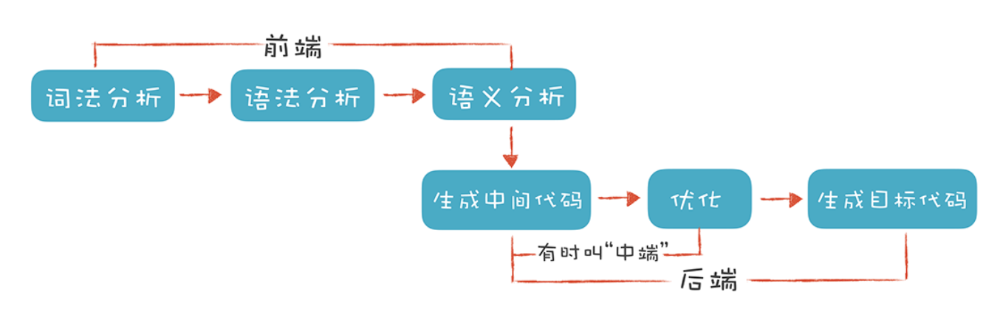

# 基础知识

#### 编译原理解决的问题

英文代码是如何被变成二进制指令

#### 编译原理使用场景

- 编写界面模板引擎
- 为项目编写各种各样的DSL
- 深度理解甚至编写Spring、Hibernate、阿里巴巴Druid这样的工具

编译原理通用流程

#### 词法分析 Lexical Analysis

#### 推荐资料

基于LLVM和C++完成一个编译前端：http://llvm.org/docs/tutorial/MyFirstLanguageFrontend/index.html