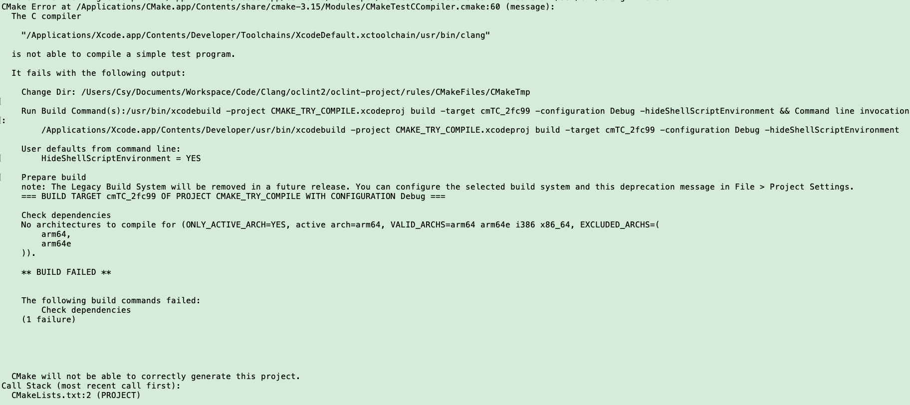

## Tips

#### OCLint，使用CMake生成Xcode 12工程，报错的解决方案

原因以及解决方案：CMake升级到3.18.1及以后。官网[release note](https://cmake.org/cmake/help/latest/release/3.18.html):

The [`Xcode`](https://cmake.org/cmake/help/latest/generator/Xcode.html#generator:Xcode) generator, when [`CMAKE_OSX_ARCHITECTURES`](https://cmake.org/cmake/help/latest/variable/CMAKE_OSX_ARCHITECTURES.html#variable:CMAKE_OSX_ARCHITECTURES) is not defined, now selects `$(NATIVE_ARCH_ACTUAL)` as the default architecture (the Xcode `ARCHS` setting). This is needed for Xcode 12 to select the host’s architecture, which older versions of Xcode did by default.

### Extensions in Swift

Extensions add new functionality to 

- class, 
- structure, 
- enumeration, 
- protocol type

Extensions can

- Add computed instance properties and computed type properties

- Define instance methods and type methods

- Provide new initializers

- Define subscripts
-  Define and use new nested types

- Make an existing type conform to a protocol”

